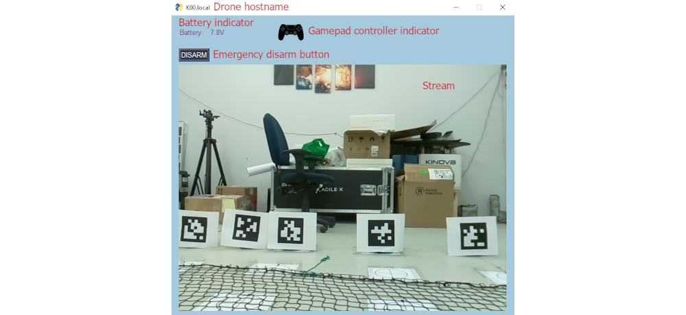

# cognifly-python
Control the CogniFly open-source drone remotely from your python script.

## Quick links

- [Drone setup instructions](/readme/DRONE_SETUP.md)
- [Installation](#installation)
- [Usage](#usage)
  - [Manual control](#manual-control)
  - [Python API](#control-though-the-python-api)
    - [Pro API](#pro-api)
    - [School API](#school-api)
    - [Streaming](#streaming)
- [Troubleshooting](#troubleshooting)
- [Advanced](#advanced-usage)
  - [Custom estimator and PIDs](#custom-estimator-and-pids)


## Installation

Please follow [drone setup instructions](/readme/DRONE_SETUP.md) to properly set up the flight controller and raspberry pi.

`cognifly-python` can be installed from PyPI.
This is done by simply executing the following on both the Raspberry Pi and the remote-controlling computer:

```bash
pip3 install --upgrade pip
pip3 install cognifly
```

## Usage

In order to use the installed library, the `cognifly_controller.py` script must first be running on Cognifly.
This can be done by connecting to the drone through SSH, and executing the following command:

```bash
cognifly-controller
```

We advise setting up a service on the rapsberry pi to launch this script automatically on CogniFly at startup, so that the user doesn't need to SSH the drone.

_Note: if using our Raspbian image on the Raspberry Pi, this service is set up already._

*Note: On the Raspberry Pi, the `cognifly-controller` command may not become available immediately after installation. If not, try closing the terminal and opening a new one.
Worst case scenario, this command is an alias for `python3 -m cognifly controller`.*


### Manual control

#### PS4 controller:

We recommend using a PS4 bluetooth gamepad for manual control of the drone, as this is pretty fun and allows you to use the drone everywhere.

First, pair your PS4 controller with the Raspberry Pi (you need to do this only once):
- ssh the Raspberry Pi: `ssh pi@my_drone_hostname.local`
- install the prerequisite: `sudo apt install bluetooth pi-bluetooth bluez`
- reboot the pi: `sudo reboot`
- ssh again: `ssh pi@my_drone_hostname.local`
- execute `sudo bluetoothctl`
- configure the bluetooth agent by executing the following commands:
  ```terminal
  agent on
  discoverable on
  pairable on
  default-agent
  ```
- launch the scan for available bluetooth devices: `scan on`
- start bluetooth pairing on the PS4 controller by pressing `share`, then the `PS` buttons simultaneously until a white light flashes
- in the scan output, look for something like `[NEW] Device AC:FD:93:14:25:D3 Wireless Controller`
- copy the MAC address (`AC:FD:93:14:25:D3` in this example but yours will differ)
- turn off scanning: `scan off`
- pair: `pair XX:XX:XX:XX:XX:XX` by replacing `XX:XX:XX:XX:XX:XX` with your copied MAC address
- connect to the controller: `connect XX:XX:XX:XX:XX:XX` (replacing `XX:XX:XX:XX:XX:XX` with your copied MAC address)
- the light stops flashing and turns blue
- trust the controller: `trust XX:XX:XX:XX:XX:XX` (replacing `XX:XX:XX:XX:XX:XX` with your copied MAC address)

Once this is done, you will not need to ssh the drone anymore; just turn your PS4 controller on and it will connect to the Raspberry Pi automatically (it may sometimes take several trials).

Controls:


_Note: when taking control over the API, the flight controller of the API is disabled but the `DISARM` emergency button and the video stream will still work.
When releasing control to the API, the `DISARM` buttons of the PS4 controller will also keep working.
By default, when a PS4 controller is connected, it takes control over the API.
The `Gamepad` indicator in the GUI monitors this._

#### Keyboard:

It is possible to manually control the drone with the keyboard via SSH, by focusing the session that executes `cognifly_controller.py` on the raspberry pi:

- `A`: arm
- `D`: disarm
- `T`: take off
- `L`: land
- `8`: forward
- `5`: backward
- `7`: left
- `9`: right
- `4`: left yaw
- `6`: right yaw
- `pageup`: up
- `pagedown`: down
- `R`: reset the board and exit the script

### Control though the python API

The remote control API is defined in [cognifly_remote.py](https://github.com/thecognifly/cognifly-python/blob/main/cognifly/cognifly_remote/cognifly_remote.py) (please read the docstrings for thorough documentation).

Connecting to the drone is as simple as creating a `Cognifly` object.
By default, this will also pop a simple Graphic User Interface:

```python
from cognifly import Cognifly

# connect to the drone and pop the GUI:
cf = Cognifly(drone_hostname="my_drone_name.local")

time.sleep(10.0)
```



The API is divided into a "pro" and a "school" API.

#### Pro API

The "pro" API is fairly simple and is what you should use for serious applications.
It enables the user to control Cognifly either by velocity or by position, in two possible coordinate systems:
- world frame: X and Y relative to the starting point of the drone, Yaw relative to the starting orientation of the drone, and Z relative to the ground,
- drone frame: X, Y and Yaw relative to the current position and orientation of the drone, and Z relative to the ground.

Example-script using the "pro" API for control:

```python
import time
from cognifly import Cognifly

# create a Cognifly object (resets the controller):
cf = Cognifly(drone_hostname="my_drone_name.local")

# arm the drone:
cf.arm()
time.sleep(1.0)

# take off to default altitude :
cf.takeoff_nonblocking()
time.sleep(10.0)

# go 0.2 m/s frontward for 1.0 second:
cf.set_velocity_nonblocking(v_x=0.2, v_y=0.0, v_z=0.0, w=0.0, duration=1.0, drone_frame=True)
time.sleep(2.0)

# go rightward and upward while rotating for 1.0 second:
cf.set_velocity_nonblocking(v_x=0.0, v_y=0.2, v_z=0.1, w=0.5, duration=1.0, drone_frame=True)
time.sleep(2.0)

# retrieve battery, pose, speed and health flags:
telemetry = cf.get_telemetry()
print(f"telemetry:\n{telemetry}")

# go to (-0.5, -0.5, 0.5) and back to the initial yaw (0.0) at a max speed of 0.25 m/s, 0.5 rad/s:
cf.set_position_nonblocking(x=-0.5, y=-0.5, z=0.5, yaw=0.0,
                            max_velocity=0.25, max_yaw_rate=0.5, max_duration=10.0, relative=False)
time.sleep(5.0)

# go frontward for 0.5 m at 0.25 m/s, staying at an altitude of 0.5 m:
cf.set_position_nonblocking(x=0.5, y=0.0, z=0.5, yaw=0.0,
                            max_velocity=0.25, max_yaw_rate=0.5, max_duration=10.0, relative=True)
time.sleep(5.0)

# go back home:
cf.set_position_nonblocking(x=0.0, y=0.0, z=0.5, yaw=0.0,
                            max_velocity=0.25, max_yaw_rate=0.5, max_duration=10.0, relative=False)
time.sleep(5.0)

# land:
cf.land_nonblocking()
time.sleep(2.0)

# disarm the drone
cf.disarm()

# reset the drone (reinitializes coordinate system):
cf.reset()
```

Note that this API is non-blocking, a new call will override the previous call
(position and velocity are controlled by PIDs, so violent changes WILL make the drone unstable).

#### School API

The "school" API is an overlay of the "pro" API, built for students who need an easy and relatively safe API for class purpose.
It is vastly inspired from the `easytello` library, of which it reproduces most of the interface, adapted to Cognifly.
Contrary to the "pro" API, calls to the "school" API are blocking and return only when the command has been fully performed (or when it times out).
It mostly consists of hidden calls to the position control "pro" API with an additional hidden callback through the `sleep_until_done` method (see the code to reproduce similar behavior with the "pro" API).

Whereas the units of the "pro" API are meters and radians, the units of the "school" API are centimeters and degrees.

Example using the "school" API for control:
```python
from cognifly import Cognifly

# create a Cognifly object (resets the controller):
cf = Cognifly(drone_hostname="my_drone_name.local")

# take off (resets the controller):
cf.takeoff()

# go forward for 50 cm:
cf.forward(50)

# turn clockwise by 90 degrees:
cf.cw(90)

# turn counter-clockwise by 45 degrees:
cf.ccw(45)

# other movements:
cf.backward(20)
cf.up(30)
cf.down(20)
cf.right(20)
cf.left(10)

# go to (0, 0, 0.5) (cm) with a yaw of 90° counter-clockwise compared to the initial orientation
cf.go(0, 0, 0.5, -90)

# sequence of position targets (when 4 items, the last is yaw):
cf.position_sequence([[0.2, 0.2, 0.5, 0.0],
                      [0.0, 0.1, 0.5],
                      [0.0, 0.0, 0.5]])

# get telemetry:
battery = cf.get_battery()
height = cf.get_height()
speed = cf.get_speed()
x, y, z = cf.get_position()
vx, vy, vz = cf.get_velocity()

# land (disarms the drone):
cf.land()
```

#### Streaming

Cognifly can stream from the raspberry pi camera (note: frames are transferred directly through the local network).
First make sure that the camera is enabled in the raspberry pi, and that it works correctly.

It is possible to display the video or to retrieve frames for processing:

```python
from cognifly import Cognifly

# create a Cognifly object (resets the controller):
cf = Cognifly(drone_hostname="my_drone_name.local")

# take off (resets the controller):
cf.takeoff()

# display the stream at 24 fps:
cf.stream(fps=24)
time.sleep(10.0)

# stop the stream:
cf.streamoff()
time.sleep(5.0)

# turn the stream on at 5 fps, with no display:
cf.streamon(fps=5)

# retrieve a frame for processing:
cv2_image = cf.get_frame()

# turn the stream off:
cf.streamoff()

# land:
cf.land()
```

## Troubleshooting
**Drift**: A slight horizontal drift of less than 1cm/s is to be expected.
However, if the drone drifts badly, disarm it, move it around and check that the position and velocity estimates make sense.
- If some estimates remain fixed: the drone is probably not in EST_POS debug mode. Carefully setup the flight controller again, according to the [drone setup instructions](/readme/DRONE_SETUP.md).
- If some estimates behave crazily: the floor is probably not textured enough. The current iteration of CogniFly uses a cheap optical flow sensor to estimate its location, and this sensor needs a lot of texture on the ground to work properly. See the [custom estimator](#custom-estimator) section to circumvent this issue.


## Advanced usage

### Custom estimator and PIDs
`cognifly-python` supports custom estimators.
A custom estimator overrides the position and velocity estimates that come from the flight controller, as these can be very poor when the ground is textureless or badly lit, due to the optical flow sensor performing poorly.

In order to design and use your own custom estimator, you must not use the `cognifly-controller` bash command, but instead write a python script in which you instantiate a `CogniflyController` object, passing a custom `PoseEstimator` to the `pose_estimator` argument. 
Doing this also enables you to customize the PID values without resorting to the API.

This can be achieved as follows:

```python
# Script to be executed on the drone, instead of the cognifly-controller bash command

from cognifly.cognifly_controller.cognifly_controller import CogniflyController, PoseEstimator

# Definition of a custom estimator:
class MyCustomEstimator(PoseEstimator):

    def get(self):
        """
        Must return a tuple of 8 values:
        (pos_x_wf, pos_y_wf, pos_z_wf, yaw, vel_x_wf, vel_y_wf, vel_z_wf, yaw_rate)
        If any is None, this is considered failure and the onboard estimator will be used instead.

        These values represent the drone attitude in the world frame:
        pos_x_wf = x position (m)
        pos_y_wf = y position (m)
        pos_z_wf = z position (m)
        yaw: yaw (rad)
        vel_x_wf = x velocity (m/s)
        vel_y_wf = y velocity (m/s)
        vel_z_wf = z velocity (m/s)
        yaw_rate: yaw rate (rad/s)

        CAUTION: your estimator needs to respect the cognifly coordinate system, which is not standard:
        x: FORWARD
        y: RIGHT
        z: UP
        """
        
        # compute pos_x_wf, pos_y_wf, pos_z_wf, yaw, vel_x_wf, vel_y_wf, vel_z_wf, yaw_rate here
        
        return pos_x_wf, pos_y_wf, pos_z_wf, yaw, vel_x_wf, vel_y_wf, vel_z_wf, yaw_rate

if __name__ == '__main__':
    # instantiate of the custom estimator:
    ce = MyCustomEstimator()
    
    # instantiate of the CogniflyController object:
    cc = CogniflyController(print_screen=True,  # set to false if you want to run headless
                            pose_estimator=ce,  # your custom estimator
                            trace_logs=False,  # set to True to save PID logs
                            vel_x_kp=750.0,  # proportional gain for X velocity
                            vel_x_ki=200.0,  # integral gain for X velocity
                            vel_x_kd=10.0,  # derivative gain for X velocity
                            vel_y_kp=750.0,  # proportional gain for Y velocity
                            vel_y_ki=200.0,  # integral gain for Y velocity
                            vel_y_kd=10.0,  # derivative gain for Y velocity
                            vel_z_kp=5.0,  # proportional gain for Z velocity
                            vel_z_ki=2.0,  # integral gain for Z velocity
                            vel_z_kd=0.05,  # derivative gain for Z velocity
                            vel_w_kp=75.0,  # proportional gain for yaw rate
                            vel_w_ki=50.0,  # integral gain for yaw rate
                            vel_w_kd=0.0,  # derivative gain for yaw rate
                            pid_limit=400,  # PID clipping value, should not exceed 500
                            x_vel_gain=0.5,  # gain from X vector to X velocity (position control)
                            y_vel_gain=0.5,  # gain from Y vector to Y velocity (position control)
                            z_vel_gain=0.2)  # gain from Z vector to Z velocity (position control)
    
    # run the controller:
    cc.run_curses()
```
_Note 1: `cognifly-python` does not entirely override the flight controller estimates internally.
Instead, it consists of an external control loop.
The internal control loop performed within the flight controller is not altered, and still uses the flight controller estimates.
Thus, the drone behavior may still differ depending on the texture of the ground._

_Note 2: `mode 2` of the gamepad uses your custom estimator, whereas `mode 1` shuts down the external control loop.
You can use `mode 2` to debug your estimator.
The `trace_logs` argument can also be set to `True` for tuning your PIDs.
Logs will then be saved under `cognifly/cognifly_controller/trace_logs`._

:warning: _**Caution**: taking off with the gamepad in `mode 2` momentarily shuts down the external control loop.
However, you can take off using your estimator thanks to the API, using `takeoff_nonblocking(track_xy=True)`._
